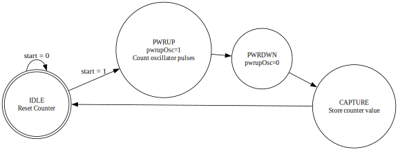
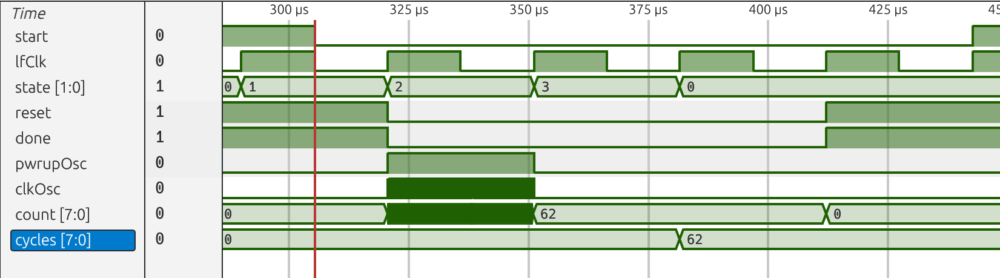
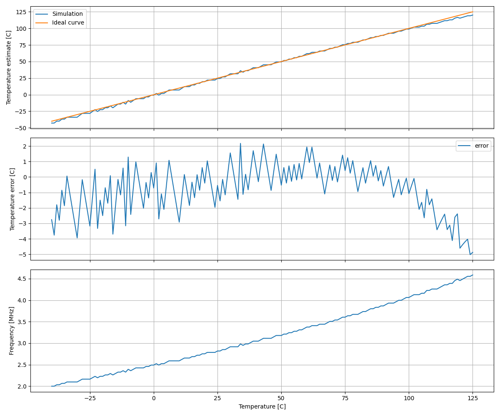
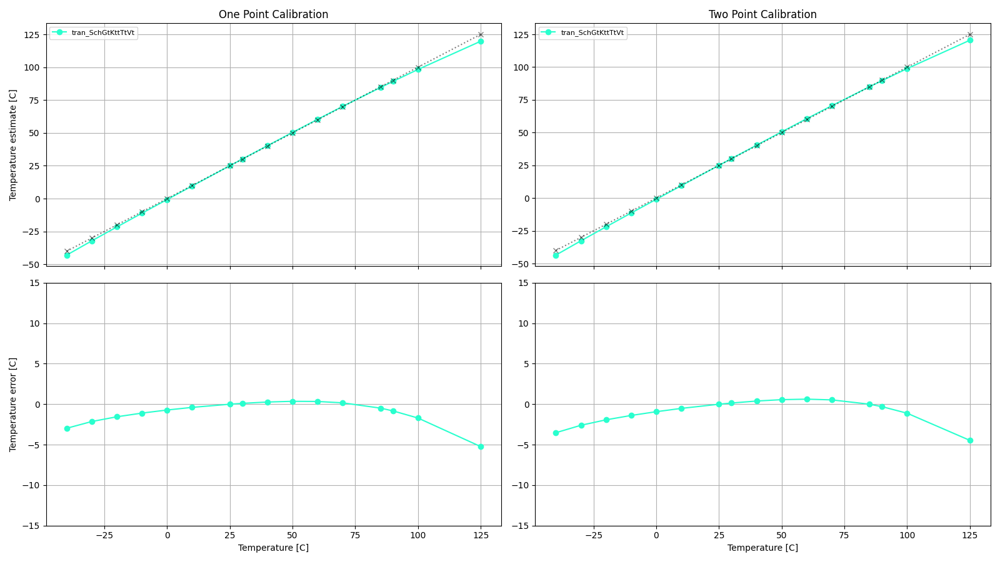
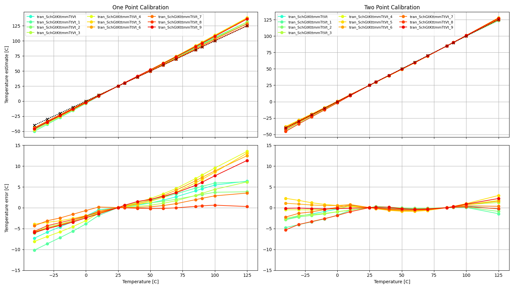
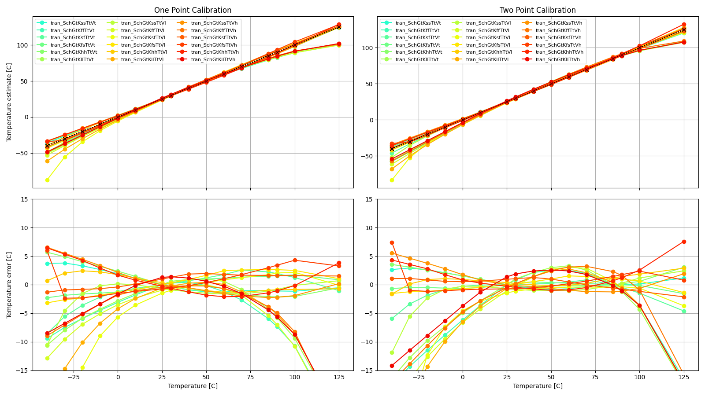

# Who

Carsten Wulff

# Why

Example of a temperature sensor 

# How

The principle of operation can be seen in the FSM below. 

The FSM starts in a IDLE state where a counter is reset. Next the temperature dependent oscillator is
started, and a number of oscillator pulses are counted. The FSM runs on a 32768 Hz clock (LF_CLK),
and we use the count x LF_CLK to measure the oscillation frequency. 

After one clock period the FSM powers down the oscillator. In the CAPTURE state
the value of the counter is stored, and the FSM returns to idle.

Figure 1: Finite-State Machine of the temperature sensor controller  

A waveform of the sequence can be seen below. Start=1 transitions the
finite-state-machine to power up
the oscillator (pwrupOsc=1), and we can notice the clkOsc counts the clock
pulses of the oscillator. On the next lfClk the oscillator is shut down and the
counter naturally stops. The value from the oscillator is stored in the cycles
register. 

Figure 2: Waves from simulation of the oscillator 

In the [testbench](sim/tb_lelo_temp/tb.v) I store the cycles, and the current
temperature to a file, and use [tb.py](sim/tb_lelo_temp/tb.py) to plot the
transfer function.

There is a second-order non-linearity as can be seen from the figure below. I've
modeled both the temperature dependent resistor in the bandgap, and the
apperantly second-order dependence of the diode voltage.

For more information on the oscillator, see [Schematics](http://analogicus.com/lelo_temp_sky130a/schematic.html).

Figure 3: Simulation of the verilog model of the oscillator

# What

| What            | Cell/Name                              |
|:----------------|:--------------------------------------:|
| Schematic       | design/LELO_TEMP_SKY130A/LELO_TEMP.sch |
| Layout          | design/LELO_TEMP_SKY130A/LELO_TEMP.mag |
| Verilog Model   | design/LELO_TEMP_SKY130A/LELO_TEMP.v   |
| Verilog Counter | rtl/tempCounter.v                      |
| Verilog Fsm     | rtl/tempFsm.v                          |
| Verilog TB      | sim/tb_lelo_temp/tb.v                  |
| Analog top TB   | sim/LELO_TEMP/tran.spi                 |

# Signal interface

| Signal       | Direction | Domain  | Description                                   |
|:-------------|:---------:|:-------:|:----------------------------------------------|
| VDD_1V8      | Input     | VDD_1V8 | Main supply                                   |
| PWRUP_1V8    | Input     | VDD_1V8 | Power up the temperature dependent oscillator |
| OSC_TEMP_1V8 | Output    | VDD_1V8 | Temperature dependent frequency               |
| VSS          | Input     | Ground  |                                               |

# Key parameters

| Parameter             | Min | Typ             | Max | Unit |
|:----------------------|:---:|:---------------:|:---:|:----:|
| Technology            |     | Skywater 130 nm |     |      |
| AVDD                  | 1.7 | 1.8             | 1.9 | V    |
| Oscillation frequency | 1.7 | 3.0             | 4.0 | MHz  |
| Temperature           | -40 | 27              | 125 | C    |

# Simulation graphs

Typical temperature error of the sensor is low, but I've calibrated the second
order correction for typical conditions.   

Over mismatch and extreme test condition (ETC) the temperature error increase. 

 Figure 4: Typical simulation results of the oscillator

 Figure 5: Mismatch simulation of the oscillator

 Figure 6: Extreme test conditions (PVT) simulation of oscillator 

