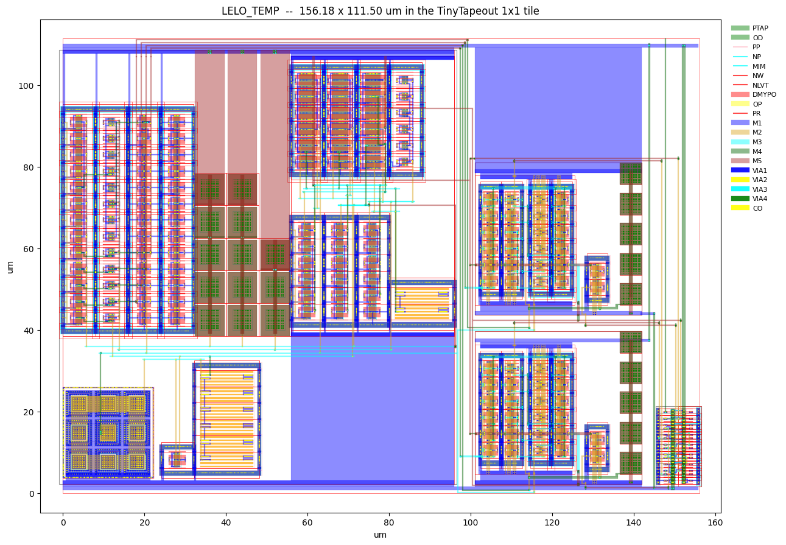
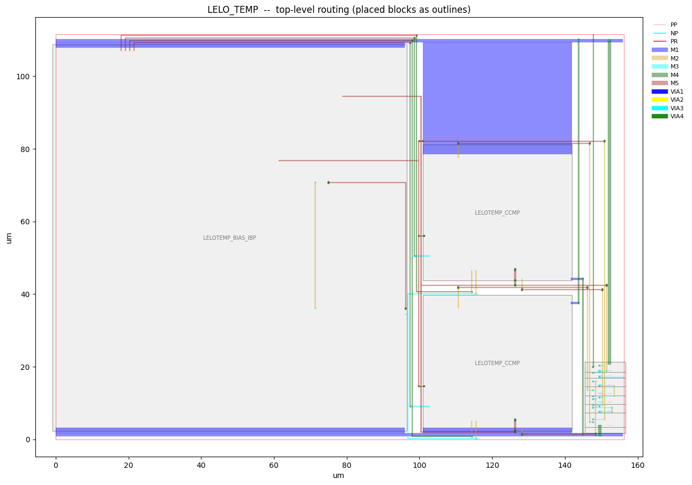

# Who

Carsten Wulff

# Why

Example of a temperature sensor 

# How

One way to make a temperature sensor is to create a temperature dependent
oscillator, and then measure the frequency of the oscillator. In Figure 0 we can
see an overview. 

A bandgap circuit is used to make a current that is proportional to absolute
temperature ($I_{PTAT}$) and a voltage that is complementary to absolute
temperature ($V_{CTAT}$). A relaxation oscillator converts the current and
voltage into a frequency ($f_{OSC}$). A digital finite-state-machine and a
counter converts the frequency to a digital value that is proportional to
temperature. 

 Figure 0: System overview 

This temperature sensor was made to conform to the specification at [The
Project: Design a temperature sensor](https://analogicus.com/aic2026/2026/01/09/The-Project.html#the-project-design-a-temperature-sensor).

For more information on the oscillator, see [Schematics](http://analogicus.com/lelo_temp_sky130a/schematic.html).

To measure the frequency of the oscillator we need a frequency reference. One
reference that is usually available in a MCU system is a 32768 Hz oscillator
($f_{32KI}$ in Figure 0).
The reason for that specific frequency is to accurately be able to count to 1 second with
a binary counter, and apparently to have a frequency for the crystal that is
higher than 20 kHz, so we can't hear it (according to <https://youtu.be/_2By2ane2I4?si=8ltUNqAPL71zCQUW>).

The principle of operation of the FSM and counter can be seen in Figure 1. 

The FSM starts in a IDLE state where a counter is reset. Next the temperature dependent oscillator is
started, and a number of oscillator pulses are counted. The FSM runs on LF_CLK
and we use the count x LF_CLK to measure the oscillation frequency. 

After one clock period the FSM powers down the oscillator. In the CAPTURE state
the value of the counter is stored, and the FSM returns to idle.

Figure 1: Finite-State Machine to control temperature sensor 

A waveform of the sequence can be seen in Figure 2. When the signal start is
asserted the FSM transitions to power up
the oscillator (pwrupOsc=1), and we can notice the clkOsc counts the clock
pulses of the oscillator. On the next lfClk the oscillator is shut down and the
counter naturally stops. The value from the oscillator is stored in the cycles
register. 

Figure 2: Waves from simulation of the oscillator 

In the [testbench](sim/tb_lelo_temp/tb.v) I store the cycles, and the testbench
temperature to a file, and use [tb.py](sim/tb_lelo_temp/tb.py) to plot the
transfer function.

I use a physical model of the oscillator ([LELO_TEMP.py](py/LELO_TEMP.py)) to
create a function to turn the frequency back to a temperature. It can be seen
that the frequency has a non-zero second order derivative, and thus, the shape
of the curve needs to be compensated for. See the python model for details.

Figure 3: Simulation of the verilog model of the oscillator

## Layout status

The whole sensor is placed and routed into a TinyTapeout 1x1 tile:
**156.18 x 111.50 um** of content in the 161.00 x 111.52 um budget.

 Figure 7: LELO_TEMP top level. The bias loop fills the left
96 um, the two comparators stack in the middle column, and the
oscillator's logic sits in the strip on the right. 

| Block | Placement | DRC | LVS |
|:------|:----------|:----|:----|
| `LELOTEMP_BIAS_IBP` | 96 x 106.5 um | 8 slivers | Circuits match uniquely |
| `LELOTEMP_CCMP`     | 41 x 37.4 um  | clean     | Circuits match uniquely |
| `LELO_TEMP` (top)   | 156.2 x 111.5 um | 93    | 30/30 devices, one artefact |

The top level's one remaining LVS line is not a routing error: magic's
hierarchical extraction promotes the OTA's `VR1` label to a twelfth
port on the bias block, and it appears with zero top-level paint
present. Every block-to-block net -- LPI, IBP_1U<3:0>, VC, both
comparator outputs, both resets, PWRUP_N, PWRUP_B, VDD_1V8 and VSS --
connects correctly.

### How the top level is routed

 Figure 8: The same cell with the placed blocks greyed out, so
only the top level's own wires show. 

Two ideas carry the routing, and both came out of failures worth
recording.

**Supplies attach at the blocks' own edges.** `addPowerConnection`
stretches *every* published supply rectangle to the ring, mid-cell tap
bars included, and each stretched copy slices through the core it came
from. The first top-level extraction came back as a single VSS blob
because of it. Each block now ties its own edge bar, and the rings sit
on an explicit rectangle spanning every instance -- the default wraps
the layout bounding box, which does not count the physical-only
tapcell, so the bottom ring landed 2 um inside the content and shorted
the logic strip's AVDD to AVSS.

**Fan-out verticals run over the logic, not beside it.** Eight nets
wanted a vertical lane in the 40 um corridor between the comparators
and the logic strip, which holds six. But the JNWTR logic cells carry
li, poly and their two M4 supply columns and nothing else, so M2, M3
and M5 are free the full height of the strip. Each net crosses the
corridor once on M5 at its own row and turns down its own M2 column
*over* the cells, with a minimum-width M3 stub to each pin. The
corridor is left carrying horizontals only.

The lane pitches are set by rules that are easy to guess wrong:

- a long M4/M5 run counts as large metal and asks **0.4 um** of its
  neighbours (met4.5a/b), not the 0.3 um of met4.2
- a via stack's pad on a layer it only *passes through* is
  0.44 um square = 0.19 um^2, under the 0.24 um^2 minimum area; the
  patch has to be long and narrow, because a square wider than the
  lane eats the spacing on both sides
- the M2-M3 cut pad is 4.4 um, wider than a 3 um column
- the strip's pin rows are 4 um apart, so the stubs reaching them run
  at minimum width

`_signal_routes` in
[LELO_TEMP.py](design/LELO_TEMP_SKY130A/LELO_TEMP.py) records every
wire and via stack it draws and reports colliding nets by name, layer
and coordinate at build time. Finding one crossing by bisecting builds
against the extract took most of a day; the report finds them all in
the build that made them. It sees shorts, not opens -- an open still
needs the netlist.

## Layout direction

The layout flow in this repository is 
currently moving from plain schematic-to-layout generation toward a more analog-aware compiler flow.

The goal is to get an agent to write the necessary python to do the layout. 

This work is described in more detail in [LAYOUT_FLOW.md](LAYOUT_FLOW.md),
and the operational guide an agent should read first is
[agent_layout](https://analogicus.com/cicpy/agent_layout) in cicpy.

# What

| What            | Cell/Name                              |
|:----------------|:---------------------------------------|
| Schematic       | design/LELO_TEMP_SKY130A/LELO_TEMP.sch |
| Layout          | design/LELO_TEMP_SKY130A/LELO_TEMP.mag |
| Verilog Model   | design/LELO_TEMP_SKY130A/LELO_TEMP.v   |
| Verilog Counter | rtl/tempCounter.v                      |
| Verilog Fsm     | rtl/tempFsm.v                          |
| Verilog TB      | sim/tb_lelo_temp/tb.v                  |
| Analog top TB   | sim/LELO_TEMP/tran.spi                 |

# Signal interface

| Signal       | Direction | Domain  | Description                                   |
|:-------------|:---------:|:-------:|:----------------------------------------------|
| VDD_1V8      | Input     | VDD_1V8 | Main supply                                   |
| PWRUP_1V8    | Input     | VDD_1V8 | Power up the temperature dependent oscillator |
| OSC_TEMP_1V8 | Output    | VDD_1V8 | Temperature dependent frequency               |
| VSS          | Input     | Ground  |                                               |

# Key parameters

| Parameter             | Min | Typ             | Max | Unit |
|:----------------------|:---:|:---------------:|:---:|:----:|
| Technology            |     | Skywater 130 nm |     |      |
| AVDD                  | 1.7 | 1.8             | 1.9 | V    |
| Oscillation frequency | 1.7 | 3.0             | 4.0 | MHz  |
| Temperature           | -40 | 27              | 125 | C    |

# Simulation graphs

Typical temperature error of the sensor is low, but I've calibrated the second
order correction for typical conditions.   

Over mismatch and extreme test condition (ETC) the temperature error increase. 

 Figure 4: Typical simulation results of the oscillator

 Figure 5: Mismatch simulation of the oscillator

 Figure 6: Extreme test conditions (PVT) simulation of oscillator 

