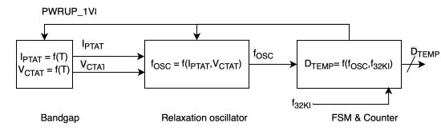
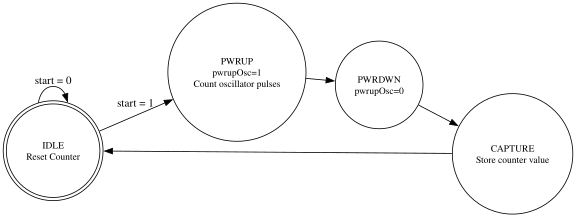
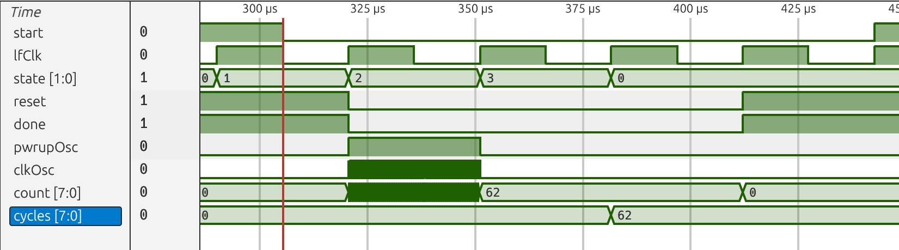
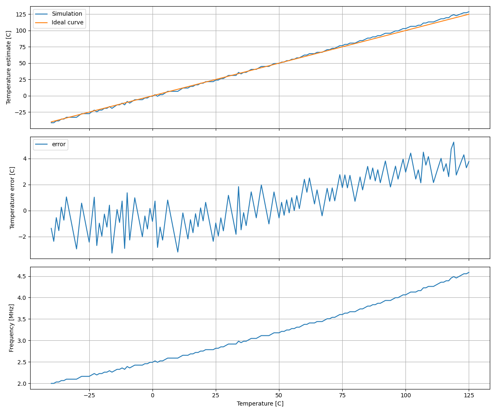
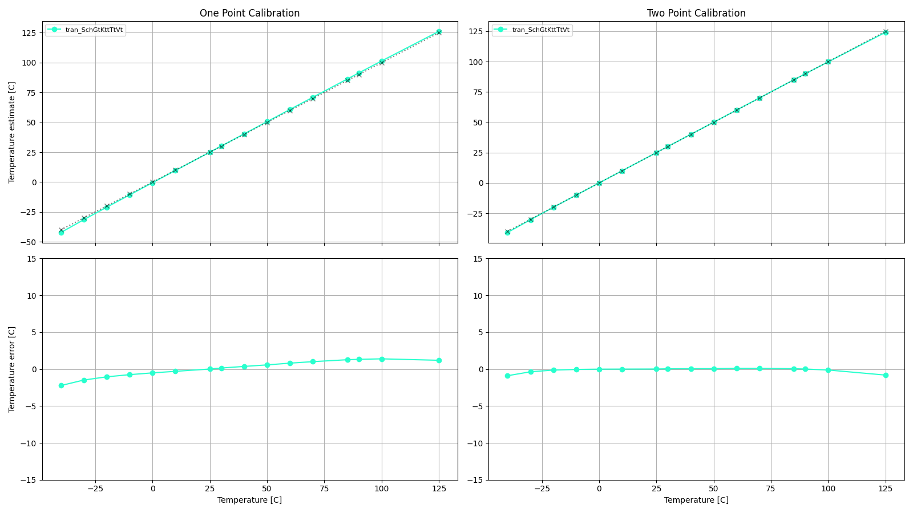
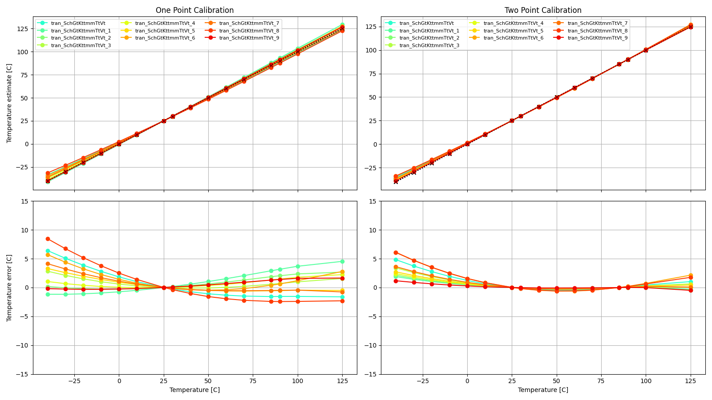

# Who

Carsten Wulff

# Why

Example of a temperature sensor 

# How

One way to make a temperature sensor is to create a temperature dependent
oscillator, and then measure the frequency of the oscillator. In Figure 0 we can
see an overview. 

A bandgap circuit is used to make a current that is proportional to absolute
temperature ($I_{PTAT}$) and a voltage that is complementary to absolute
temperature ($V_{CTAT}$). A relaxation oscillator converts the current and
voltage into a frequency ($f_{OSC}$). A digital finite-state-machine and a
counter converts the frequency to a digital value that is proportional to
temperature. 

 Figure 0: System overview 

This temperature sensor was made to conform to the specification at [The
Project: Design a temperature sensor](https://analogicus.com/aic2026/2026/01/09/The-Project.html#the-project-design-a-temperature-sensor).

For more information on the oscillator, see [Schematics](http://analogicus.com/lelo_temp_sky130a/schematic.html).

To measure the frequency of the oscillator we need a frequency reference. One
reference that is usually available in a MCU system is a 32768 Hz oscillator
($f_{32KI}$ in Figure 0).
The reason for that specific frequency is to accurately be able to count to 1 second with
a binary counter, and apparently to have a frequency for the crystal that is
higher than 20 kHz, so we can't hear it (according to <https://youtu.be/_2By2ane2I4?si=8ltUNqAPL71zCQUW>).

The principle of operation of the FSM and counter can be seen in Figure 1. 

The FSM starts in a IDLE state where a counter is reset. Next the temperature dependent oscillator is
started, and a number of oscillator pulses are counted. The FSM runs on LF_CLK
and we use the count x LF_CLK to measure the oscillation frequency. 

After one clock period the FSM powers down the oscillator. In the CAPTURE state
the value of the counter is stored, and the FSM returns to idle.

Figure 1: Finite-State Machine to control temperature sensor 

A waveform of the sequence can be seen in Figure 2. When the signal start is
asserted the FSM transitions to power up
the oscillator (pwrupOsc=1), and we can notice the clkOsc counts the clock
pulses of the oscillator. On the next lfClk the oscillator is shut down and the
counter naturally stops. The value from the oscillator is stored in the cycles
register. 

Figure 2: Waves from simulation of the oscillator 

In the [testbench](sim/tb_lelo_temp/tb.v) I store the cycles, and the testbench
temperature to a file, and use [tb.py](sim/tb_lelo_temp/tb.py) to plot the
transfer function.

I use a physical model of the oscillator ([LELO_TEMP.py](py/LELO_TEMP.py)) to
create a function to turn the frequency back to a temperature. It can be seen
that the frequency has a non-zero second order derivative, and thus, the shape
of the curve needs to be compensated for. See the python model for details.

Figure 3: Simulation of the verilog model of the oscillator

## Layout direction

The layout flow in this repository is 
currently moving from plain schematic-to-layout generation toward a more analog-aware compiler flow.

The goal is to get an agent to write the necessary python to do the layout. 

This work is described in more detail in [LAYOUT_FLOW.md](LAYOUT_FLOW.md),
and the operational guide an agent should read first is
[agent_layout](https://analogicus.com/cicpy/agent_layout) in cicpy.

### Bias block status

The bias loop `LELOTEMP_BIAS_IBP` now uses the pmos input OTA
`LELOTEMP_OTA` again. The nmos input version ran out of input common mode
at the hot end: the OTA inputs sit at a diode voltage, roughly 0.45 V at
125 C, and an nmos pair needs about 0.6 V on a 1.8 V supply. A startup of
two diode connected pmos in series from VDD into VD1 breaks the zero
current state and turns itself off once the loop runs. Typical transient:
1.15 uA per output, 29 uA supply, 0.62 us settling.

`LELOTEMP_OTA` placement is DRC clean. Routing is **not finished**. What
is left, in order:

1. **The VCP ladder placement shorts before any route.** The `xbs`
   devices form a series chain, and stacked at the library overlap pitch
   the cells merge their M2 rails, which shorts every junction to
   VDD_1V8. DRC does not see this, `cicpy sch2mag --check-connectivity`
   does, and `--strict` refuses to route until it is fixed. Opening the
   stack pitch was not enough; the layout GUI cross probe is the fastest
   way to see which shapes merge.
2. **Two router limitations block bundle routing** of the columns that
   carry several nets on one terminal. Horizontal bars of a row channel
   all land at the same height regardless of the `track` option, so two
   nets sharing a channel short, and `routeMirror` puts every rail of a
   column at the same x. Both want a fix in cicpy rather than a
   workaround here.
3. **Cross links between the column rails** are then drawn one at a time
   under `cicpy sch2mag --strict`, which stops at the first route that
   creates a short and names the command and line that drew it.
4. LVS closes it: `make gds cdl lvs CELL=LELOTEMP_OTA`. DRC alone cannot
   see a short.

The nets still open are listed by the connectivity check: VD1, VD2, VD3,
VBP, VO, VCP, VS, net1, PWRUP_1V8, PWRUP_N_1V8, VIN, VIP and the ladder
nets net2 to net6.

# What

| What            | Cell/Name                              |
|:----------------|:---------------------------------------|
| Schematic       | design/LELO_TEMP_SKY130A/LELO_TEMP.sch |
| Layout          | design/LELO_TEMP_SKY130A/LELO_TEMP.mag |
| Verilog Model   | design/LELO_TEMP_SKY130A/LELO_TEMP.v   |
| Verilog Counter | rtl/tempCounter.v                      |
| Verilog Fsm     | rtl/tempFsm.v                          |
| Verilog TB      | sim/tb_lelo_temp/tb.v                  |
| Analog top TB   | sim/LELO_TEMP/tran.spi                 |

# Signal interface

| Signal       | Direction | Domain  | Description                                   |
|:-------------|:---------:|:-------:|:----------------------------------------------|
| VDD_1V8      | Input     | VDD_1V8 | Main supply                                   |
| PWRUP_1V8    | Input     | VDD_1V8 | Power up the temperature dependent oscillator |
| OSC_TEMP_1V8 | Output    | VDD_1V8 | Temperature dependent frequency               |
| VSS          | Input     | Ground  |                                               |

# Key parameters

| Parameter             | Min | Typ             | Max | Unit |
|:----------------------|:---:|:---------------:|:---:|:----:|
| Technology            |     | Skywater 130 nm |     |      |
| AVDD                  | 1.7 | 1.8             | 1.9 | V    |
| Oscillation frequency | 1.7 | 3.0             | 4.0 | MHz  |
| Temperature           | -40 | 27              | 125 | C    |

# Simulation graphs

Typical temperature error of the sensor is low, but I've calibrated the second
order correction for typical conditions.   

Over mismatch and extreme test condition (ETC) the temperature error increase. 

 Figure 4: Typical simulation results of the oscillator

 Figure 5: Mismatch simulation of the oscillator

 Figure 6: Extreme test conditions (PVT) simulation of oscillator 

